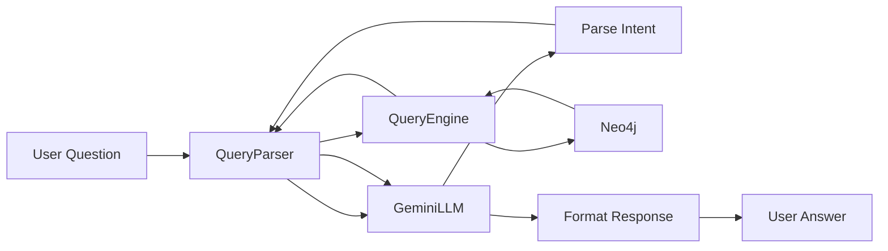

## Overview

The Engineering Knowledge Graph uses **Gemini 2.5 Flash** to transform natural language questions into structured graph queries. This allows engineers to ask questions like "Who owns the payment service?" or "What breaks if redis goes down?" without writing Cypher or understanding the graph schema.

## Architecture

The natural language processing flow consists of three main components:

<Steps>
  <Step title="GeminiLLM">
    Interfaces with Google's Gemini API to parse intent and format responses.
  </Step>
  
  <Step title="QueryParser">
    Bridges natural language and the query engine, maintaining conversation context.
  </Step>
  
  <Step title="QueryEngine">
    Executes the structured graph queries against Neo4j.
  </Step>
</Steps>



## GeminiLLM Class

The `GeminiLLM` class (`chat/llm.py:14`) handles all interactions with the Gemini API:

```python chat/llm.py
class GeminiLLM:
    """Gemini LLM client for query parsing and response generation."""
    
    def __init__(self, api_key: str = None):
        """Initialize Gemini client."""
        self.api_key = api_key or os.getenv('GEMINI_API_KEY')
        if not self.api_key:
            raise ValueError("GEMINI_API_KEY environment variable is required")
        
        self.client = genai.Client(api_key=self.api_key)
        logger.info("Initialized Gemini LLM client")
```

<Note>
The system uses `gemini-2.5-flash` for optimal balance of speed, cost, and accuracy.
</Note>

## Intent Parsing

### System Prompt

The LLM is instructed via a comprehensive system prompt that defines all supported query types (`chat/llm.py:37-92`):

```python chat/llm.py
system_prompt = """
You are an expert at parsing natural language queries about engineering infrastructure and converting them to structured queries.

Given a user query, determine the query type and extract relevant parameters.

Query types and their parameters:
1. "get_node" - Get single node by ID
   - node_id: string
   
2. "get_nodes" - List nodes by type
   - node_type: string (service, database, cache, team, deployment)
   - filters: dict (optional)
   
3. "downstream" - What does X depend on?
   - node_id: string
   - edge_types: list (optional: calls, uses, depends_on)
   
4. "upstream" - What depends on X?
   - node_id: string  
   - edge_types: list (optional: calls, uses, depends_on)
   
5. "blast_radius" - Full impact analysis
   - node_id: string
   
6. "path" - How does X connect to Y?
   - from_id: string
   - to_id: string
   
7. "get_owner" - Who owns X?
   - node_id: string
   
8. "get_team_assets" - What does team X own?
   - team_name: string

9. "find_by_property" - Find nodes with specific property
   - property_name: string
   - property_value: any

10. "services_using_database" - What services use database X?
    - database_name: string

Node ID format: "type:name" (e.g., "service:order-service", "database:users-db")

Respond with JSON only:
{
  "query_type": "...",
  "parameters": {...},
  "confidence": 0.0-1.0,
  "reasoning": "brief explanation"
}
"""
```

### Parsing Method

The `parse_query_intent` method (`chat/llm.py:26`) sends the user query to Gemini and parses the structured response:

```python chat/llm.py
def parse_query_intent(self, user_query: str, context: Dict[str, Any] = None) -> Dict[str, Any]:
    """
    Parse user query to determine intent and extract parameters.
    
    Args:
        user_query: Natural language query from user
        context: Optional conversation context
        
    Returns:
        Dictionary with query type, parameters, and confidence
    """
    user_prompt = f"User query: {user_query}"
    if context:
        user_prompt += f"\nContext: {context}"
    
    try:
        response = self.client.models.generate_content(
            model='gemini-2.5-flash',
            contents=system_prompt + "\n\n" + user_prompt
        )
        
        response_text = response.text.strip()
        
        # Extract JSON from response
        if response_text.startswith('```json'):
            response_text = response_text[7:-3]
        elif response_text.startswith('```'):
            response_text = response_text[3:-3]
        
        parsed_response = json.loads(response_text)
        return parsed_response
```

### Intent Response Structure

<Tabs>
  <Tab title="Successful Parse">
    ```json
    {
      "query_type": "get_owner",
      "parameters": {
        "node_id": "service:payment-service"
      },
      "confidence": 0.95,
      "reasoning": "User is asking about team ownership of a service"
    }
    ```
  </Tab>
  
  <Tab title="Low Confidence">
    ```json
    {
      "query_type": "unknown",
      "parameters": {},
      "confidence": 0.2,
      "reasoning": "Query is ambiguous or outside supported query types"
    }
    ```
  </Tab>
  
  <Tab title="Complex Query">
    ```json
    {
      "query_type": "blast_radius",
      "parameters": {
        "node_id": "cache:redis-main"
      },
      "confidence": 0.88,
      "reasoning": "User wants impact analysis for redis failure"
    }
    ```
  </Tab>
</Tabs>

## Query Examples

Here's how different natural language queries are parsed:

<AccordionGroup>
  <Accordion title="Who owns the payment service?">
    **Intent:**
    ```json
    {
      "query_type": "get_owner",
      "parameters": {
        "node_id": "service:payment-service"
      },
      "confidence": 0.95
    }
    ```
    
    **Graph Query:**
    ```python
    query_engine.get_owner('service:payment-service')
    ```
  </Accordion>
  
  <Accordion title="What breaks if redis goes down?">
    **Intent:**
    ```json
    {
      "query_type": "upstream",
      "parameters": {
        "node_id": "cache:redis-main"
      },
      "confidence": 0.92
    }
    ```
    
    **Graph Query:**
    ```python
    query_engine.upstream('cache:redis-main')
    ```
  </Accordion>
  
  <Accordion title="List all databases">
    **Intent:**
    ```json
    {
      "query_type": "get_nodes",
      "parameters": {
        "node_type": "database"
      },
      "confidence": 0.98
    }
    ```
    
    **Graph Query:**
    ```python
    query_engine.get_nodes('database')
    ```
  </Accordion>
  
  <Accordion title="How does frontend connect to the users database?">
    **Intent:**
    ```json
    {
      "query_type": "path",
      "parameters": {
        "from_id": "service:frontend",
        "to_id": "database:users-db"
      },
      "confidence": 0.90
    }
    ```
    
    **Graph Query:**
    ```python
    query_engine.path('service:frontend', 'database:users-db')
    ```
  </Accordion>
  
  <Accordion title="What does the payments team own?">
    **Intent:**
    ```json
    {
      "query_type": "get_team_assets",
      "parameters": {
        "team_name": "payments"
      },
      "confidence": 0.96
    }
    ```
    
    **Graph Query:**
    ```python
    query_engine.get_team_assets('payments')
    ```
  </Accordion>
  
  <Accordion title="What's the blast radius of the payment service?">
    **Intent:**
    ```json
    {
      "query_type": "blast_radius",
      "parameters": {
        "node_id": "service:payment-service"
      },
      "confidence": 0.94
    }
    ```
    
    **Graph Query:**
    ```python
    query_engine.blast_radius('service:payment-service')
    ```
  </Accordion>
</AccordionGroup>

## QueryParser Class

The `QueryParser` class (`chat/query_parser.py:14`) orchestrates the entire query processing pipeline:

```python chat/query_parser.py
class QueryParser:
    """Parses natural language queries and executes graph operations."""
    
    def __init__(self, query_engine: QueryEngine, llm: GeminiLLM):
        self.query_engine = query_engine
        self.llm = llm
        self.conversation_context = {}
```

### Query Processing Flow

<Steps>
  <Step title="Parse Intent">
    Send user query to Gemini for intent recognition:
    
    ```python chat/query_parser.py
    intent = self.llm.parse_query_intent(user_query, context)
    ```
  </Step>
  
  <Step title="Check Confidence">
    Reject low-confidence queries:
    
    ```python chat/query_parser.py
    if intent['confidence'] < 0.3:
        return {
            'response': "I'm not sure I understand your question. Could you rephrase it?",
            'query_type': 'clarification',
            'confidence': intent['confidence']
        }
    ```
  </Step>
  
  <Step title="Execute Graph Query">
    Route to appropriate query engine method:
    
    ```python chat/query_parser.py
    query_result = self._execute_graph_query(intent)
    ```
  </Step>
  
  <Step title="Format Response">
    Use Gemini to generate human-readable response:
    
    ```python chat/query_parser.py
    formatted_response = self.llm.format_response(
        query_result, 
        user_query, 
        intent['query_type']
    )
    ```
  </Step>
  
  <Step title="Update Context">
    Store query history for follow-up questions:
    
    ```python chat/query_parser.py
    self._update_context(session_id, user_query, intent, query_result)
    ```
  </Step>
</Steps>

### Query Execution Routing

The `_execute_graph_query` method (`chat/query_parser.py:79`) routes parsed intents to query engine methods:

```python chat/query_parser.py
def _execute_graph_query(self, intent: Dict[str, Any]) -> Any:
    """Execute the appropriate graph query based on parsed intent."""
    query_type = intent['query_type']
    params = intent['parameters']
    
    try:
        if query_type == 'get_node':
            return self.query_engine.get_node(params['node_id'])
        
        elif query_type == 'get_nodes':
            return self.query_engine.get_nodes(
                params.get('node_type'),
                params.get('filters')
            )
        
        elif query_type == 'downstream':
            return self.query_engine.downstream(
                params['node_id'],
                edge_types=params.get('edge_types')
            )
        
        elif query_type == 'upstream':
            return self.query_engine.upstream(
                params['node_id'],
                edge_types=params.get('edge_types')
            )
        
        elif query_type == 'blast_radius':
            return self.query_engine.blast_radius(params['node_id'])
        
        elif query_type == 'path':
            return self.query_engine.path(
                params['from_id'],
                params['to_id']
            )
        
        elif query_type == 'get_owner':
            return self.query_engine.get_owner(params['node_id'])
        
        elif query_type == 'get_team_assets':
            return self.query_engine.get_team_assets(params['team_name'])
```

## Response Formatting

After executing the graph query, Gemini formats the raw results into conversational responses.

### Format Response Method

```python chat/llm.py
def format_response(self, query_result: Any, user_query: str, query_type: str) -> str:
    """
    Format query results into human-readable response.
    
    Args:
        query_result: Result from graph query
        user_query: Original user query
        query_type: Type of query executed
        
    Returns:
        Human-readable response string
    """
    system_prompt = f"""
You are a helpful assistant explaining engineering infrastructure query results.

The user asked: "{user_query}"
Query type: {query_type}

Format the following query result into a clear, helpful response:
- Use bullet points for lists
- Include relevant details like team ownership, ports, etc.
- Be concise but informative
- If no results, explain why and suggest alternatives
- For blast radius queries, emphasize the impact and affected teams

Query result:
{json.dumps(query_result, indent=2)}

Provide a natural, conversational response.
"""
    
    try:
        response = self.client.models.generate_content(
            model='gemini-2.5-flash',
            contents=system_prompt
        )
        return response.text.strip()
```

### Example Formatted Responses

<Tabs>
  <Tab title="Owner Query">
    **Raw Result:**
    ```json
    {
      "id": "team:payments",
      "type": "team",
      "name": "payments",
      "lead": "Alice Smith",
      "slack_channel": "#team-payments"
    }
    ```
    
    **Formatted Response:**
    > The payment service is owned by the **payments** team. The team lead is Alice Smith, and you can reach them on Slack at #team-payments.
  </Tab>
  
  <Tab title="Blast Radius">
    **Raw Result:**
    ```json
    {
      "upstream_dependencies": [/* 5 services */],
      "downstream_dependencies": [/* 2 databases */],
      "affected_teams": ["payments", "checkout", "notifications"],
      "summary": "If redis-main fails, it could affect 5 upstream and 2 downstream components, impacting 3 teams."
    }
    ```
    
    **Formatted Response:**
    > If redis-main goes down, it would have significant impact:
    >
    > **Affected Services (5):**
    > - payment-service
    > - checkout-service
    > - notification-service
    > - user-session-service
    > - cart-service
    >
    > **Affected Teams (3):**
    > - payments
    > - checkout
    > - notifications
    >
    > This is a critical dependency that should have monitoring and failover configured.
  </Tab>
  
  <Tab title="Empty Results">
    **Raw Result:**
    ```json
    []
    ```
    
    **Formatted Response:**
    > I couldn't find any services using that database. This could mean:
    > - The database name is misspelled
    > - The database isn't currently in use
    > - The database hasn't been discovered by the connectors yet
    >
    > Try using "list all databases" to see available databases.
  </Tab>
</Tabs>

## Conversation Context

The QueryParser maintains session-based context for follow-up questions (`chat/query_parser.py:183`):

```python chat/query_parser.py
def _update_context(self, session_id: str, user_query: str, intent: Dict[str, Any], result: Any):
    """Update conversation context for follow-up queries."""
    if session_id not in self.conversation_context:
        self.conversation_context[session_id] = {}
    
    context = self.conversation_context[session_id]
    context['last_query'] = user_query
    context['last_intent'] = intent
    context['last_result'] = result
    
    # Extract entities for follow-up queries
    if isinstance(result, list) and result:
        context['last_entities'] = [
            item.get('name') for item in result 
            if isinstance(item, dict) and 'name' in item
        ]
    elif isinstance(result, dict) and 'name' in result:
        context['last_entities'] = [result['name']]
```

**Example Context Usage:**

```python
# First query
User: "List all databases"
Context: {}

# Follow-up query
User: "Who uses the first one?"
Context: {
  'last_query': 'List all databases',
  'last_entities': ['users-db', 'payments-db', 'sessions-db']
}
# LLM can infer "first one" = "users-db"
```

## Error Handling

<AccordionGroup>
  <Accordion title="Low Confidence Queries">
    Queries with confidence < 0.3 trigger clarification:
    
    ```python chat/query_parser.py
    if intent['confidence'] < 0.3:
        return {
            'response': "I'm not sure I understand your question. Could you rephrase it?",
            'query_type': 'clarification',
            'confidence': intent['confidence']
        }
    ```
  </Accordion>
  
  <Accordion title="Empty Results">
    The system suggests alternatives when queries return no results:
    
    ```python chat/query_parser.py
    def _handle_empty_result(self, user_query: str, intent: Dict[str, Any]):
        # Try to suggest alternatives
        if query_type in ['get_node', 'get_owner']:
            node_id = params.get('node_id', '')
            if ':' in node_id:
                node_type, node_name = node_id.split(':', 1)
                # Look for similar nodes
                similar_nodes = self.query_engine.get_nodes(node_type)
                similar_names = [
                    node['name'] for node in similar_nodes 
                    if node_name.lower() in node['name'].lower()
                ]
                if similar_names:
                    suggestions.append(
                        f"Did you mean one of these {node_type}s: {', '.join(similar_names[:5])}?"
                    )
    ```
  </Accordion>
  
  <Accordion title="Query Execution Failures">
    Graph query errors are caught and returned as user-friendly messages:
    
    ```python chat/query_parser.py
    try:
        query_result = self._execute_graph_query(intent)
    except Exception as e:
        logger.error(f"Error processing query '{user_query}': {e}")
        return {
            'response': f"I encountered an error processing your query: {str(e)}",
            'query_type': 'error',
            'confidence': 0.0
        }
    ```
  </Accordion>
</AccordionGroup>

## Complete Query Flow Example

<Steps>
  <Step title="User asks question">
    ```python
    user_query = "What services will break if the users database goes down?"
    ```
  </Step>
  
  <Step title="QueryParser calls Gemini">
    ```python
    intent = llm.parse_query_intent(user_query)
    # Returns:
    # {
    #   "query_type": "upstream",
    #   "parameters": {"node_id": "database:users-db"},
    #   "confidence": 0.92
    # }
    ```
  </Step>
  
  <Step title="Execute graph query">
    ```python
    result = query_engine.upstream('database:users-db')
    # Returns list of dependent services
    ```
  </Step>
  
  <Step title="Format response">
    ```python
    response = llm.format_response(result, user_query, 'upstream')
    # Returns conversational explanation with bullet points
    ```
  </Step>
  
  <Step title="Return to user">
    ```python
    {
      'response': formatted_response,
      'query_type': 'upstream',
      'confidence': 0.92,
      'raw_result': result
    }
    ```
  </Step>
</Steps>

## Benefits of LLM-Based Parsing

<CardGroup cols={2}>
  <Card title="Natural Interaction" icon="message">
    Users don't need to learn Cypher or understand the graph schema.
  </Card>
  
  <Card title="Flexible Phrasing" icon="language">
    Same query can be asked multiple ways with equivalent results.
  </Card>
  
  <Card title="Context Awareness" icon="brain">
    Follow-up questions leverage conversation history.
  </Card>
  
  <Card title="Helpful Errors" icon="circle-question">
    Low confidence or empty results trigger clarifications and suggestions.
  </Card>
</CardGroup>

## Next Steps

<CardGroup cols={2}>
  <Card title="Query Engine" icon="magnifying-glass" href="/concepts/query-engine">
    Review available graph query operations.
  </Card>
  
  <Card title="Quickstart" icon="rocket" href="/quickstart">
    Try natural language queries in the web interface.
  </Card>
</CardGroup>